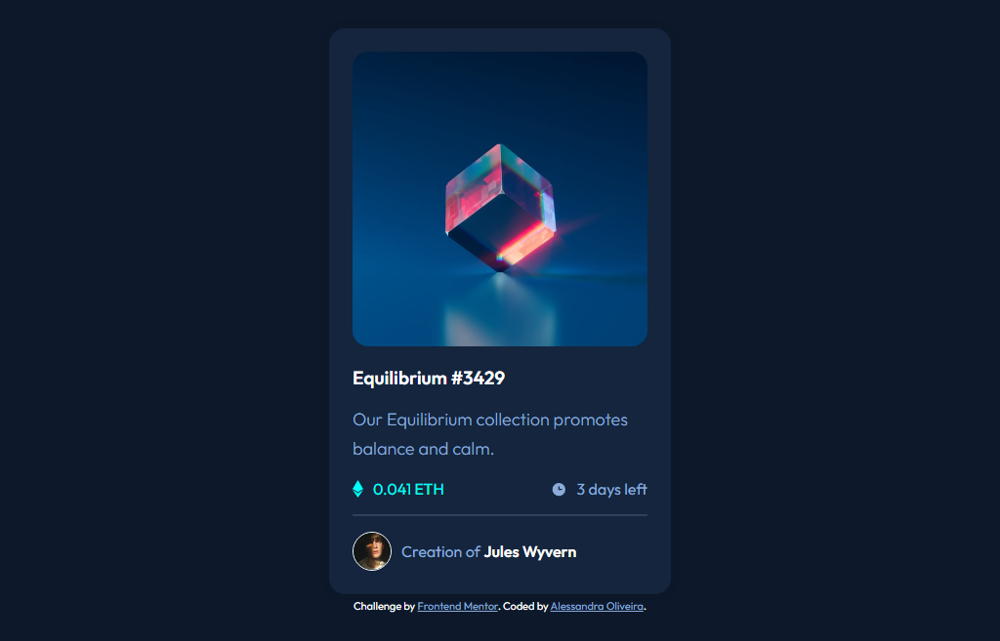
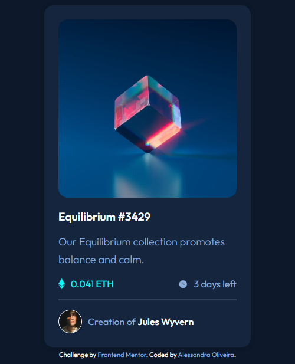

# Frontend Mentor - NFT preview card component solution

This is a solution to the [NFT preview card component challenge on Frontend Mentor](https://www.frontendmentor.io/challenges/nft-preview-card-component-SbdUL_w0U). Frontend Mentor challenges help you improve your coding skills by building realistic projects. 

## Table of contents

- [Overview](#overview)
  - [The challenge](#the-challenge)
  - [Screenshot](#screenshot)
  - [Links](#links)
- [My process](#my-process)
  - [Built with](#built-with)
  - [Useful resources](#useful-resources)
- [Author](#author)

## Overview

This is a NFT preview card and the users are able to see hover states for interactive elements.

### The challenge

Users should be able to:

- View the optimal layout depending on their device's screen size
- See hover states for interactive elements

### Screenshot

  

### Links

- Solution URL: [Add solution URL here](https://your-solution-url.com)

## My process

### Built with

- Semantic HTML5 markup
- CSS custom properties

### Useful resources

- [Converting Colors](https://convertingcolors.com/) - Particullarly I like to call the colors on my CSS code by its HEX code (not always the best choice though). This website converts the code for you from any format you have to any format you like. By now, it is my favorite.

## Author

- Frontend Mentor - [@itsale-o](https://www.frontendmentor.io/profile/itsale-o)
- LinkedIn - [alessandra-santos-oliveira](https://www.linkedin.com/in/alessandra-santos-oliveira/)
- Twitter - [@itsale_o](https://twitter.com/itsale_o) (I don't talk about work there but feel free to follow me)